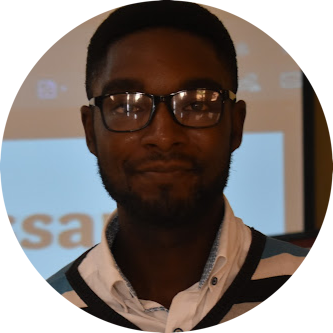

# About Me

I am a Research Scientist in Artificial Intelligence working actively on Computer Vision, Natural Language Processing and foundation of machine learning and deep learning. I'm currently building an AI research group called [WedOO.ai](https://www.linkedin.com/company/wedoo-ai/) where we can team up with brillant minds and contribute to breakthrough in medecine, agriculture, robotics and language resources.

I completed my master degree at the African Institute for Mathematical Sciences ([AIMS](https://aims-cameroon.org)), with specialization in data science and I'am currently pursuing my studies at the African Masters in Machine Intelligence ([AMMI](https://aimsammi.org)).

# News

- Jan 2023: Research intern in SCI-LAB based in Houston. Working on improving large scale agglomerative clustering algorithms on stock market dataset.
- Jul 2022: I Co-authored the paper entitled _Reduction of Data Transmission in an IOT Wireless Sensor Network_, accepted in the Pan-Artificial Intelligence and Smart Systems Conference([PA-AI&&SS 2022](https://paaiss.com)) to be presented on _NOV 2022_. The aforedmention paper will appear in the lecture note of the Institute for Computer Sciences, Social-Informatics and Telecommunications Engineering (LNICST), [Springer Series](https://www.springer.com/series/8197).
- Feb 2021: I Co-organized [WedOO.ai](https://www.linkedin.com/company/wedoo-ai/) first data science [competition](https://zindi.africa/competitions/cameroon-fraud-detection-in-electricity-and-gas-consumption-challenge) in [ZINDI-Africa](https://zindi.africa)
- Nov 2021: I am a guess speaker at the [IndabaX Cameroon](https://deeplearningindaba.com/2021/indabax/indabax-cameroon/).

# Community Engagements

- Sept 2022: Became One of the Cameroon's ZINDI ambassador. [Zindi Africa](https://zindi.africa) is a data science competition platform and a learning community that brings together data scientist across the world to provide top solutions to real world problems via series of competition. My main role as a Zindi Ambassador is to sensitize aspiring data scientist and data science communitites to leverage their skills in the Zindi Community.

# Selected and Invited Talks
 
 - Sep 2021: Lectured the _9th_ cohort of AIMS on [_Data Prediction in Wireless Sensor Network_](https://aims-cameroon.org/researcher/2021-alumnus-allassan-nkeng-lectures-students-on-data-prediction-in-wireless-sensor-networks/).
 
# Awards

- Mar 2021: 3rd prize winner of the [AIMS-Microsoft data science hackathon](https://zindi.africa/competitions/aims-data-science-hackathon) launched in the [ZINDI](https://zindi.africa) platform. The competition entails us to build a machine learning model that can accurately predict the wealth index of 7 african countries inorder to help governments and policy makers to make inform decision concerning poverty.

# Research and Publication

I am currently working on NLP with interest in entity discovery together with Dr. [Louis Martin](https://louismartin.eu), research scientist at [Meta AI](https://ai.facebook.com). The main interest of our research is to be able to discover similar and  new hashtags from tweets, using latent space clustering. We aim to use a pretrain language model to extract embeddings, and use a generative model to perform clustering. The rest of my work include:

- Oct 2022: **[Data Prediction Based Encoder-Decoder Learning in Wireless Sensor Networks](https://ieeexplore.ieee.org/document/9915570)**, accepted and published in [IEEE Xplore](https://ieeexplore.ieee.org). Co-authors: [Arouna Ndam Njoya](https://ieeexplore.ieee.org/author/37085710472),[Berthine Nyunga Mpinda](https://ieeexplore.ieee.org/author/37089569374), [Christopher Thron](https://ieeexplore.ieee.org/author/37085676820), [Ado Adamou Abba Ari](https://ieeexplore.ieee.org/author/37086960635), [Ousmane Thiare](https://ieeexplore.ieee.org/author/37832417100),[Emmanuel Tonye](https://ieeexplore.ieee.org/author/37603754000),[Abdelhak Gueroui](https://ieeexplore.ieee.org/author/37284836300).

